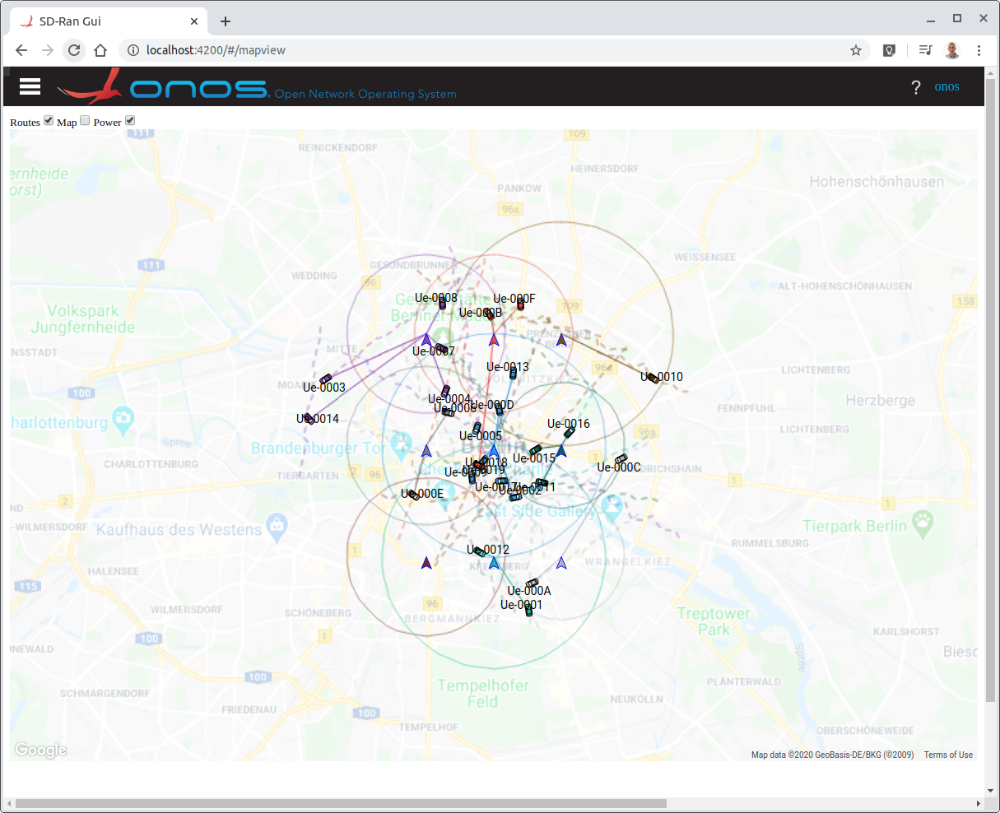

# SD-RAN GUI

The SD-RAN GUI is part of µONOS and is meant to work alongside `sd-ran-gui` and
the `envoy-proxy`. The `ran-simulator` in turn works with `onos-ran` through the
**E2** interface.

The `ran-simulator` mimics a collection of Cell Towers and a set of UE's moving along
routes between different locations. The `sd-ran-gui` displays these dynamically
on a Google Map.

All application tuning is done through startup parameters on `ran-simulator`. Like
`ran-simulator` it can be run:
 
* as a standalone application in docker
* as part of a **docker-compose** collection of applications
* deployed in a **Kubernetes** cluster

## Google Maps API Key
The SD RAN GUI accesses Google Maps API and incurs a cost of $7.00 per
1000 requests. The API Key is not kept in the code base and must be passed in as
the **ENV** variable `GOOGLE_API_KEY` when the Docker is run.

See [sd-ran-gui-deployment](sd-ran-gui-deployment.md) for how to perform a Kubernetes deployment.

See [docker-compose.md](../../ran-simulator/docs/docker-compose.md) for a Docker Compose deployment.

## Browser access
When deployed the simulation can be accessed
from a browser.

This shows the default deployment with
* A Google Map centered over Berlin
* 3 x 3 Towers at given spacings
* Zoomed to include most of the city
* 3 routes (and hence 3 UEs active at any time)
* Choosing routes start and finish points from among 10 random locations around the Towers
* The Map is faded to increase the visibility of the towers and routes
* The route paths are shown as dotted lines

At intervals of `stepDelayMs` (default every second) each UE moves one step along
its route.

When `ran-simulator` has **2 modes** of generating routes:
1. When no Google API Key is provided to `ran-simulator` routes will be randomly
generated between a start point and an end point - a pseudo straight line with
random perturbations
2. When a Google Api Key is provided to `ran-simulator` the route is retrieved from
the Google Directions API, and the number of steps in the route usually varies
between 25 and 150. When a UE reaches the end of its route, it uses that
End Location as the start of a new Route and randomly chooses a new Location as its
end point and starts moving along it.

This continues on indefinitely.

A second browser window opened on a second device will show identical movements.

